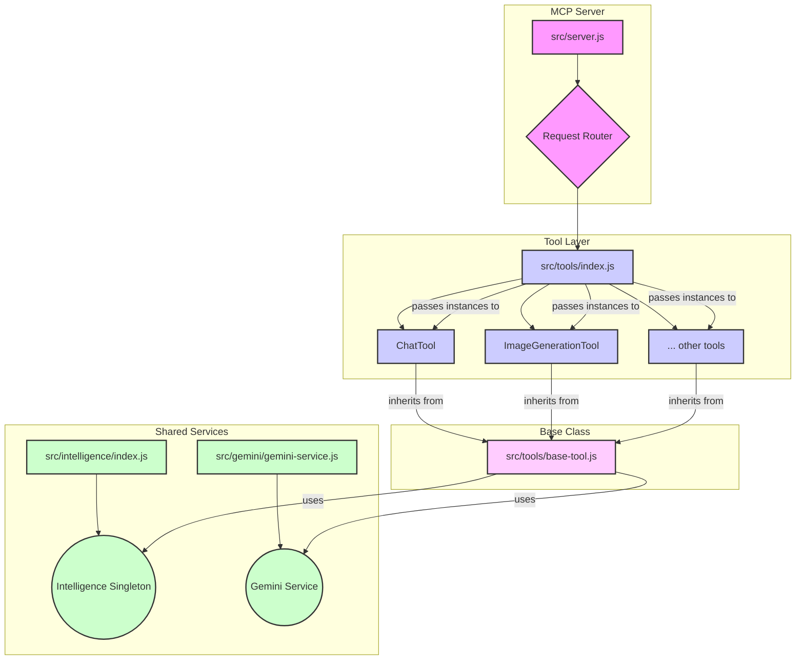

# Gemini MCP Server with Smart Tool Intelligence

Welcome to the Gemini MCP Server, a cutting-edge implementation of the Model Context Protocol (MCP) that integrates advanced Smart Tool Intelligence. This server is designed to provide powerful AI-driven tools, capable of self-learning and adapting to user preferences and contexts, making interactions more intuitive and efficient.

## 🚀 Features

*   **7 AI-Powered Tools:**
    *   `generate_image`: Generate images from text prompts.
    *   `gemini-edit-image`: Edit existing images based on instructions.
    *   `gemini-chat`: Engage in conversations with Gemini AI.
    *   `gemini-transcribe-audio`: Transcribe audio files to text.
    *   `gemini-code-execute`: Execute Python code in a sandbox.
    *   `gemini-analyze-video`: Analyze video content for summaries, transcripts, and more.
    *   `gemini-analyze-image`: Analyze images for content, objects, and text.
*   **Smart Tool Intelligence System:**
    *   **Self-Learning Capabilities:** Learns from successful interactions to enhance future prompts.
    *   **Pattern Recognition:** Identifies common usage patterns and user preferences.
    *   **Prompt Enhancement:** Automatically refines prompts for better AI model performance.
    *   **Context Detection:** Understands the context of a request to apply relevant intelligence.
    *   **Verbatim Mode:** Special context for audio transcriptions that ensures word-for-word output.
*   **Internal Storage:** JSON-based preference management system for persistent learning.
*   **Enterprise Architecture:** Modular design with clear separation of concerns, promoting maintainability and extensibility.

## ⚙️ Setup and Installation

To get the Gemini MCP Server up and running, follow these steps:

1.  **Clone the repository:**
    ```bash
    git clone https://github.com/Garblesnarff/gemini-mcp-server.git
    cd gemini-mcp-server
    ```
2.  **Install Dependencies:**
    Navigate to the project root directory and install the necessary Node.js packages:
    ```bash
    npm install
    ```
3.  **Configure Gemini API Key:**
    The server requires a Google Gemini API key to interact with the Gemini models.
    *   Obtain your API key from the [Google AI Studio](https://aistudio.google.com/app/apikey).
    *   Create a file named `.env` in the root directory of the project.
    *   Add your API key to the `.env` file in the following format:
        ```
        GEMINI_API_KEY=YOUR_GEMINI_API_KEY_HERE
        ```
    *   **Important:** Do not commit your `.env` file to version control. It is already included in `.gitignore`.

## ▶️ Running the Server

The Gemini MCP Server communicates via standard input/output (stdin/stdout) as per the MCP specification.

To start the server:

```bash
node gemini-server.js
```

Once running, the server will listen for MCP requests on `stdin` and send responses to `stdout`.

## 🧪 Testing and Examples

You can test the server's functionality using the provided test scripts or by integrating it with an MCP client.

*   **Basic Test:**
    ```bash
    node test-internal-storage.js
    ```
*   **Tool Intelligence Test:**
    ```bash
    node test-tool-intelligence.js
    ```
*   **Full Tool Intelligence Test:**
    ```bash
    node test-tool-intelligence-full.js
    ```
*   **Verbatim Mode Test:**
    ```bash
    node test-verbatim-mode.js
    ```

### Using Verbatim Mode for Transcriptions

When using the audio transcription tool, you can get exact word-for-word transcriptions by setting the context to "verbatim":

```javascript
// For exact transcriptions including all utterances, pauses, and filler words
const result = await gemini_transcribe_audio({
  file_path: "/path/to/audio.mp3",
  context: "verbatim"
});
```

Without verbatim mode, the Tool Intelligence system will enhance prompts based on learned preferences, which may result in more concise or summarized transcriptions.

## 📚 Architecture Overview

The server is built with a modular and extensible architecture:



*   **`src/server.js`**: The main entry point, handling MCP protocol communication and routing requests to appropriate handlers.
*   **`src/tools/index.js`**: The central tool registry and dispatcher. It initializes all tools and provides methods for listing and calling them.
*   **`src/tools/base-tool.js`**: An abstract base class that all specific tools extend. It provides common properties and enforces the `execute` method.
*   **`src/intelligence/index.js`**: The singleton instance of the Smart Tool Intelligence System. It coordinates context detection, prompt enhancement, and pattern learning, ensuring a consistent learning state across all tools.
*   **`src/gemini/gemini-service.js`**: A service layer that encapsulates all interactions with the Google Gemini API, abstracting away the complexities of model configuration and content generation.

## 🤝 Contributing

We welcome contributions! Please see our [CONTRIBUTING.md](CONTRIBUTING.md) for detailed guidelines on how to set up your development environment, adhere to coding standards, and submit changes.

## 📄 License

This project is licensed under the [MIT License](LICENSE).